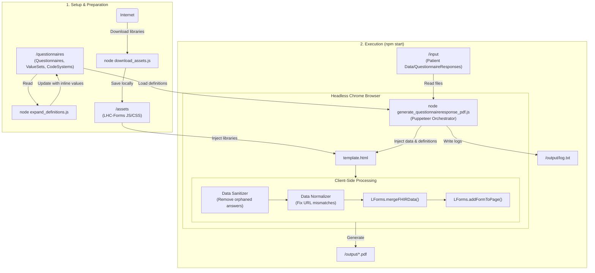

# Questionnaire Response PDF

This Node.js tool automates the generation of PDF medical reports from FHIR QuestionnaireResponses. It combines QuestionnaireResponses (patient answers) with Questionnaires (form definitions) to render professional, readable documents using the LHC-Forms library.

Node.js is chosen because the core problem involves automating a browser (Puppeteer) to render a client-side JavaScript library (LForms). Using Node.js allows the orchestration script and the rendering environment to share the same language and data structures (JSON), eliminating serialization friction. Additionally, Node.js's native asynchronous I/O excels at the concurrent file processing required for batch PDF generation.

## Features

- **Offline Ready**: Runs entirely locally without needing to connect to external FHIR servers.
- **Batch Processing**: Converts an entire folder of FHIR Bundles or JSON files into PDFs in seconds.
- **Multiple QuestionnaireResponse Support**: Combines multiple questionnaires from the same Bundle into a single PDF with clear section separation.
- **Smart Data Extraction**: Automatically extracts patient information from Bundle resources or falls back to QuestionnaireResponse metadata.
- **CarePlan Integration**: Displays CarePlan categories with codes and clinical context in the report header.
- **Crash Protection**: Automatically sanitizes mismatched data to prevent rendering failures.
- **Enhanced Text Wrapping**: Ensures long answer text displays properly across multiple lines.
- **Security Hardened**: Input validation, file size limits, CSP headers, and secure browser execution.
- **Content Validation**: Validates JSON structure and file integrity before processing.

## Installation

### Clone the repository

```bash
git clone <repository-url>
cd questionnaire-response-pdf
```

### Install dependencies

You need Node.js installed.

```bash
npm install
```

### Download static assets

This fetches the required LHC-Forms JavaScript/CSS libraries so the tool works offline.

```bash
node download_assets.js
```

## Folder Structure

When you first clone this repo, these folders will be empty. You need to populate them:

- **questionnaires/**: (Required) Place your FHIR Questionnaire, ValueSet, and CodeSystem JSON files here.
- **input/**: (Required) Place your patient data files here:
  - FHIR Bundles containing Patient, CarePlan, and QuestionnaireResponse resources
  - Standalone QuestionnaireResponse JSON files
  - Supports multiple QuestionnaireResponses per Bundle
- **output/**: (Generated) The resulting PDF reports and logs will appear here.

## Workflow

### Step 1: Load Definitions

Drop all your definitional artifacts (Questionnaires, ValueSets, etc.) into the `/questionnaires` folder.

### Step 2: Pre-process Definitions

Run the expansion script. This "bakes" the ValueSets directly into the Questionnaires.

**Important**: This step is critical if your Questionnaires use `answerValueSet` to refer to external lists of codes. LHC-Forms requires these options to be defined inline (`answerOption`) to render correctly in an offline environment.

```bash
node expand_definitions.js
```

**Note**: You only need to run this when you add or change your Questionnaires.

### Step 3: Add Data

Drop your patient JSON/XML-JSON files into the `/input` folder.

### Step 4: Generate Reports

Run the main generator:

```bash
npm start
```

Check the `/output` folder for your PDFs and `log.txt`.

## Scripts Explained

### 1. download_assets.js

**Purpose**: Prepares the environment for offline use.

It downloads the specific version of the LHC-Forms widget (JS and CSS) and the FHIR Support library from the National Library of Medicine (NLM) CDN. These files are saved to the `/assets` folder so the generator doesn't rely on an internet connection during rendering.

### 2. expand_definitions.js

**Purpose**: Solves "Missing ValueSet" errors and enables offline rendering.

LHC-Forms typically tries to fetch answer lists (ValueSets) from the URLs defined in the Questionnaire (e.g., https://fhir.nhs.wales/...). Since we are running locally/offline, these requests fail.

This script scans your `/questionnaires` folder, finds every `answerValueSet` reference, looks up the corresponding ValueSet in your local files, and in-lines the codes directly into the Questionnaire (converting them to `answerOption`). It overwrites the files in `/questionnaires` with this self-contained version.

### 3. generate_questionnaireresponse_pdf.js

**Purpose**: The main orchestration engine.

- Launches a headless Chrome browser (Puppeteer).
- Reads every file in `/input` and processes all QuestionnaireResponses.
- **Multi-QR Processing**: Combines multiple QuestionnaireResponses from the same Bundle into sections within a single PDF.
- **Smart Data Extraction**: Extracts patient info from Patient resources or falls back to QuestionnaireResponse subject data.
- **CarePlan Integration**: Displays CarePlan categories with clinical codes in the report header.
- **Enhanced Template**: Injects data and LForms library into a responsive template with improved text wrapping.
- **Sanitizes Data**: Removes answers that don't exist in the definition to prevent crashes (with detailed logging of removed items).
- **Normalizes Data**: Fixes minor mismatches (like http vs https system URLs) so answers don't disappear (with comprehensive change tracking).
- **Comprehensive Audit Logging**: Tracks every sanitization removal and normalization change for full transparency.
- Prints the final rendered page as a PDF to `/output`.


## Architecture Diagram



## Input File Types Supported

### FHIR Bundles
- **Complete Clinical Context**: Bundles with Patient, CarePlan, and QuestionnaireResponse resources
- **Multiple Questionnaires**: Supports multiple QuestionnaireResponses per Bundle (combined into one PDF)
- **Rich Headers**: Extracts patient demographics, CarePlan categories with codes, and clinical context

### Standalone QuestionnaireResponse Files  
- **Minimal Context**: Uses QuestionnaireResponse subject, author, and metadata for header information
- **Fallback Data**: Displays subject.display or subject.reference as patient name
- **Single Questionnaire**: Each file produces one PDF section

## PDF Output Examples

### Bundle with Multiple QuestionnaireResponses
```
Patient: Alice Jones | DOB: 1980-09-13 | MRN: A000003
Care Plan: Cancer pathway - myeloma (CMY); Medical oncology (394593009)
Author: Consultant

━━━━━━━━━━━━━━━━━━━━━━━━━━━━━━━━━━━━━━━━━━━━━━━━━━━━━━━━━━━━━━━━━
EQ-5D-5L Questionnaire
━━━━━━━━━━━━━━━━━━━━━━━━━━━━━━━━━━━━━━━━━━━━━━━━━━━━━━━━━━━━━━━━━
[Questionnaire 1 with patient responses]

━━━━━━━━━━━━━━━━━━━━━━━━━━━━━━━━━━━━━━━━━━━━━━━━━━━━━━━━━━━━━━━━━
Data Entry Questionnaire
━━━━━━━━━━━━━━━━━━━━━━━━━━━━━━━━━━━━━━━━━━━━━━━━━━━━━━━━━━━━━━━━━
[Questionnaire 2 with patient responses]
```

## Troubleshooting

- **"LForms library not loaded"**: Run `node download_assets.js`.
- **"Definition not found"**: Ensure the Questionnaire URL in your Response matches a file in `/questionnaires`.
- **Invisible Answers / Missing Dropdowns**: Ensure you ran `node expand_definitions.js` to bake the ValueSet options into the form.
- **Text Truncation**: The tool automatically handles long answer text with enhanced wrapping - no additional configuration needed.
- **Multiple QRs not showing**: Check that your Bundle contains multiple QuestionnaireResponse resources - they will be combined automatically.